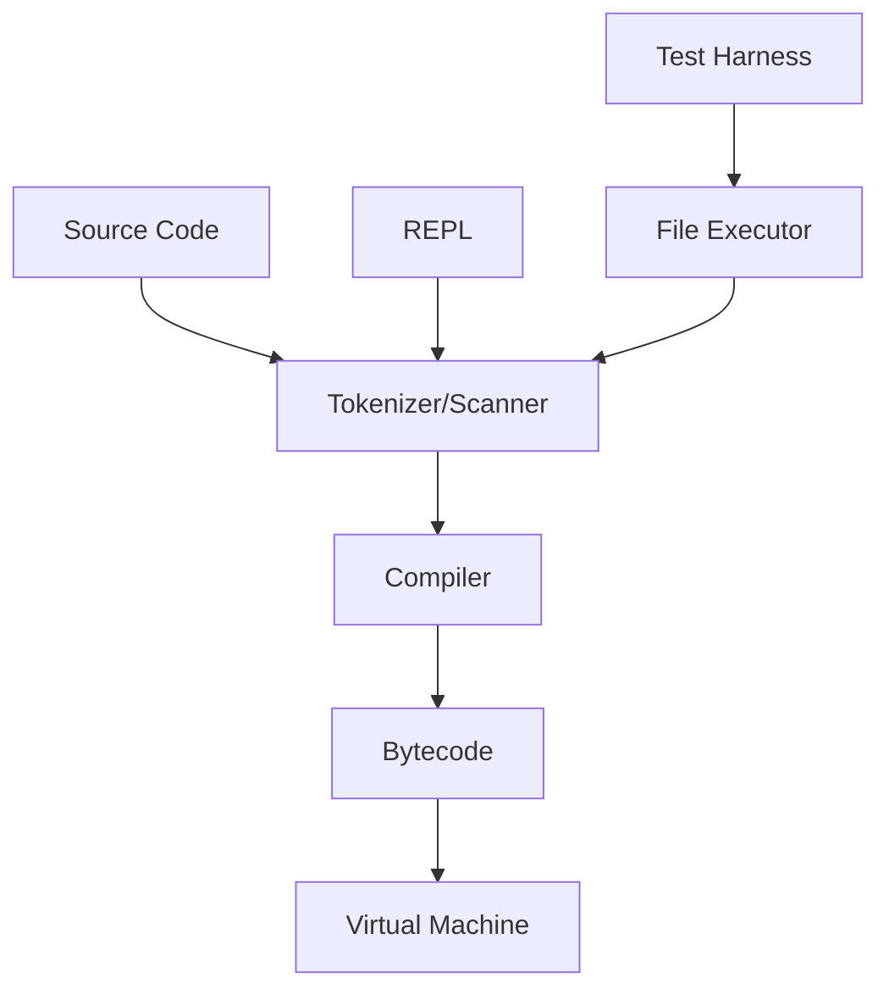

# System Patterns

## System Architecture
The Tardi language system consists of the following main components:
1. Virtual Machine (VM)
2. Tokenizer/Scanner
3. Compiler
4. REPL (Read-Eval-Print Loop)
5. File Executor

## Key Technical Decisions
1. Language Implementation: Rust
2. Version Control: jj with git backend
3. Build System: Cargo (Rust's package manager and build tool)
4. Test Framework: Cargo test with custom test harness
5. Task Runner: just (commands defined in Justfile)

## Design Patterns
1. Stack-based architecture for the VM
2. Concatenative programming paradigm
3. Test-Driven Development (TDD) approach
4. SOLID principles in code organization

## Component Relationships

## Project Structure
- `/src`: All source code
  - `main.rs`: Primary entrypoint for the executable
  - `lib.rs`: Primary entrypoint for the library
  - `error.rs`: Defines different errors and bundles them into one enum
- `/tests`: Integration tests
  - `/fixtures`: Test fixtures (*.tardi, *.stderr, *.stdout files)
- `/docs`: Documentation

## Error Handling
- Custom error types defined in `error.rs`
- Result type alias for error handling

## Testing Strategy
- Integration tests using custom test harness. Create an integration test before each major functionality is implemented.
- Unit tests written before implementation (TDD approach)
- Test fixtures for various scenarios

## Code Organization
- SOLID principles
- Constants defined at the top of each file
- Minimal code duplication (refactor after three repetitions)
