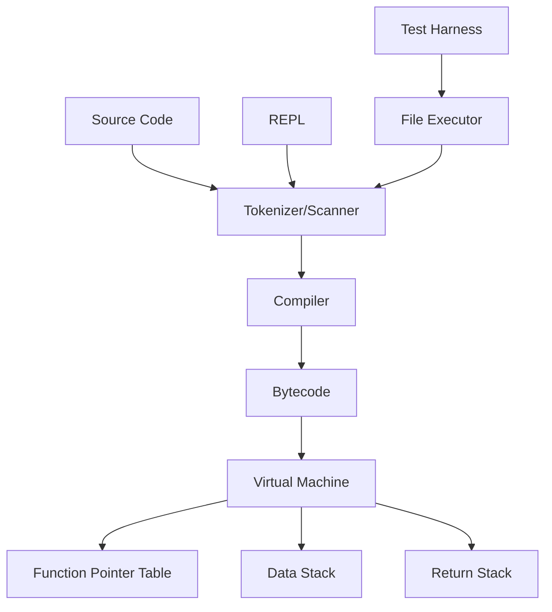

# System Patterns

## System Architecture
The Tardi language system consists of the following main components:
1. Virtual Machine (VM)
   - Indirect Threaded Code (ITC) implementation
   - Function pointer table for operation dispatch
   - Stack-based execution model
2. Tokenizer/Scanner
3. Compiler
4. REPL (Read-Eval-Print Loop)
5. File Executor

## Key Technical Decisions
1. Language Implementation: Rust
2. Version Control: jj with git backend
3. Build System: Cargo (Rust's package manager and build tool)
4. Test Framework: Cargo test with custom test harness
5. Task Runner: just (commands defined in Justfile)
6. VM Implementation: Indirect Threading (ITC)
   - Chosen for balance of performance and safety
   - Avoids unsafe code while maintaining reasonable performance
   - Uses function pointer table for operation dispatch
   - May be optimized to Direct Threading in future if needed

## Design Patterns
1. Stack-based architecture for the VM
2. Concatenative programming paradigm
3. Test-Driven Development (TDD) approach
4. SOLID principles in code organization
5. Indirect Threaded Code pattern for VM implementation
   - Operation indices stored in instruction stream
   - Function pointer table for operation lookup
   - Simple interpreter loop for execution

## Component Relationships

## Project Structure
- `/src`: All source code
  - `main.rs`: Primary entrypoint for the executable
  - `lib.rs`: Primary entrypoint for the library
  - `error.rs`: Defines different errors and bundles them into one enum
  - `vm/`: Virtual machine implementation
    - `mod.rs`: VM module definition
    - `ops.rs`: Operation implementations
    - `stack.rs`: Stack implementations
- `/tests`: Integration tests
  - `/fixtures`: Test fixtures (*.tardi, *.stderr, *.stdout files)
- `/docs`: Documentation

## VM Architecture
- Indirect Threaded Code (ITC) implementation
  - Function pointer table stores operation implementations
  - Instruction stream contains indices into function table
  - Basic interpreter loop:
    1. Fetch next operation index
    2. Look up function pointer in table
    3. Execute operation
    4. Repeat
- Stack Management
  - Data stack for operation arguments and results
  - Return stack (planned) for control flow
- Error Handling
  - Custom error types for VM operations
  - Stack underflow/overflow protection
  - Type checking for operations

## Error Handling
- Custom error types defined in `error.rs`
- Result type alias for error handling
- VM-specific error types for operation failures

## Testing Strategy
- Integration tests using custom test harness. Create an integration test before each major functionality is implemented.
- Unit tests written before implementation (TDD approach)
- Test fixtures for various scenarios
- VM operation tests:
  - Stack manipulation correctness
  - Error handling
  - Edge cases

## Code Organization
- SOLID principles
- Constants defined at the top of each file
- Minimal code duplication (refactor after three repetitions)
- Clear separation of VM components:
  - Core VM logic
  - Operation implementations
  - Stack management
