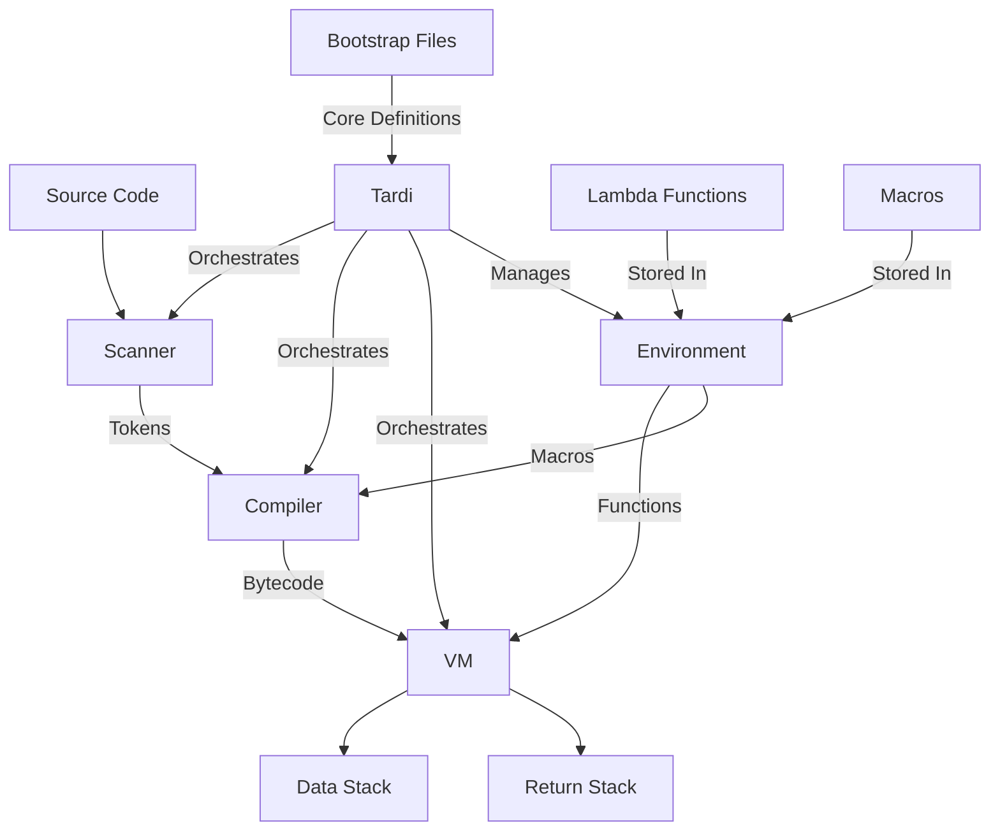

# System Patterns

## System Architecture
The Tardi language system consists of the following main components:
1. Tardi Orchestrator
   - Central point for managing execution environment
   - Coordinates scanner, compiler, VM, and environment
   - Handles bootstrapping process
2. Virtual Machine (VM)
   - Indirect Threaded Code (ITC) implementation
   - Function pointer table for operation dispatch
   - Stack-based execution model with data and return stacks
3. Scanner (Tokenizer)
   - Supports macros and immediate words
   - Handles token buffering for macro expansion
4. Compiler
   - Bytecode generation
   - Macro expansion support
   - Function compilation
5. Environment
   - Manages global state
   - Stores function definitions
   - Handles macro definitions
6. Bootstrap System
   - Loads core macros and operations
   - Initializes language features in Tardi code

## Key Technical Decisions
1. Language Implementation: Rust
2. Version Control: jj with git backend
3. Build System: Cargo (Rust's package manager and build tool)
4. Test Framework: Cargo test with custom test harness
5. Task Runner: just (commands defined in Justfile)
6. VM Implementation: Indirect Threading (ITC)
   - Chosen for balance of performance and safety
   - Avoids unsafe code while maintaining reasonable performance
   - Uses function pointer table for operation dispatch
   - May be optimized to Direct Threading in future if needed
7. Bootstrapping Approach
   - Core language features implemented in Tardi
   - Loaded from bootstrap directory in sorted order
   - Enables self-hosting capabilities

## Design Patterns
1. Stack-based architecture for the VM
   - Data stack for operation arguments and results
   - Return stack for control flow and function calls
2. Concatenative programming paradigm
3. Test-Driven Development (TDD) approach
4. SOLID principles in code organization
5. Trait-based component interfaces
   - Scan trait for tokenization
   - Compile trait for bytecode generation
   - Execute trait for VM operations
6. Shared state management using Rc/RefCell
7. Macro system for compile-time metaprogramming

## Component Relationships

## Project Structure
- `/src`: All source code
  - `main.rs`: Primary entrypoint for the executable
  - `lib.rs`: Primary entrypoint for the library
  - `core/`: Core language functionality and traits
  - `env.rs`: Environment implementation
  - `error.rs`: Error types and handling
  - `value.rs`: Value types and operations
  - `shared.rs`: Shared state utilities
  - `vm/`: Virtual machine implementation
    - `mod.rs`: VM module definition
    - `ops.rs`: Operation implementations
  - `compiler/`: Compiler implementation
  - `scanner/`: Scanner implementation
- `/bootstrap`: Core language definitions
  - `00-core-macros.tardi`: Core macro definitions
  - `01-stack-ops.tardi`: Stack operation definitions
  - `02-core-ops.tardi`: Core operation definitions
- `/tests`: Integration tests
  - `/fixtures`: Test fixtures
- `/docs`: Feature documentation

## VM Architecture
- Indirect Threaded Code (ITC) implementation
  - Function pointer table for operation dispatch
  - Lambda functions for user-defined words
  - Support for immediate (macro) words
- Stack Management
  - Data stack for operation arguments
  - Return stack for control flow
  - Stack safety checks
- Operations
  - Stack manipulation (dup, swap, rot, etc.)
  - Arithmetic (+, -, *, /)
  - Comparison (==, <, >, !)
  - List operations (create-list, append, etc.)
  - String operations
  - Function operations (call, apply, return)
  - Macro support operations

## Error Handling
- Custom error types for each component
- Result type alias for consistent error handling
- Stack safety checks
- Macro expansion error handling
- Function call error handling

## Testing Strategy
- Integration tests with custom harness
- Fixture-based testing
  - .tardi files for input
  - .stderr/.stdout files for expected output
- Unit tests for components
- TDD approach for new features
- Bootstrap file testing

## Code Organization
- SOLID principles
- Clear component boundaries
- Trait-based interfaces
- Minimal code duplication
- Bootstrap-first approach for core features
